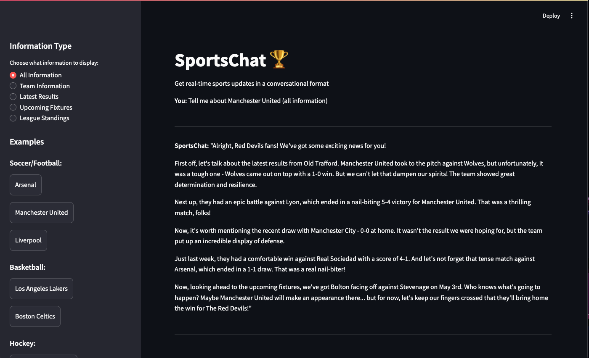

# SportsChat
SportsChat is a conversational AI chatbot that provides real-time sports updates using TheSportsDB API. It can fetch team details for various sports teams and deliver information in an engaging, conversational format.



## Features
- Get information about teams from leagues like EPL, NBA, NHL, NFL, and more
- View latest match results and upcoming fixtures
- Check current league standings
- Conversational responses using Ollama's LLM capabilities
- Interactive Streamlit web interface with chat history
- Example teams for quick testing

## Technology Stack
- Python
- LangChain with Ollama integration
- TheSportsDB API for sports data
- Streamlit for the user interface

## Setup
1. Clone the repository
2. Install dependencies: `pip install -r requirements.txt`
3. Create a `.env` file with your API keys:
   ```
   THESPORTSDB_API_KEY=your_key_here
   ```
4. Ensure Ollama is installed and running locally
5. Run the application: `python main.py`
